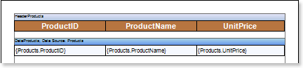
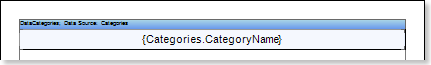
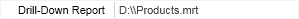
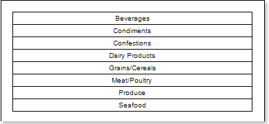
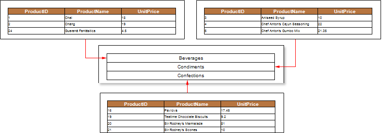

## Drill-Down Reports Using External Report

The drill-down report with another (external) report means an interactive report in which the main and detailed data are located in different reports. It is possible to create such a report using the **Interaction.Drill-Down Report** property. Consider the example of a Drill-Down Report using an external report. First, create a report with detailed data. This report will contain a list of products and their prices. Put the **Data Band** in the page of the report template with text components which contain expressions: **Products.ProductID**, **Products.ProductName** and **Products.UnitPrice**. For this band, you should select the data source **Products**. Also add the **Header Band**. The picture below shows a page template with detailed information:

Add a filter with the expression **(int)this["CategoryID"] == Products.CategoryID** in the **Data Band**. After that, you must save the report template. For example save the report to: **D:\\Products.mrt**. Now create a report that will contain the main data in this example, the category names. Put the **Data Band** with a text component in the page template. The text component will contain the expression **Categories.CategoryName**. For this band, you should select the data source **Categories**. The picture below shows a page of the report template with the main data.

Then, select the text component and change the values ​​of some properties. The **Interaction.Drill-Down Enabled** property must be set to **true**. Then, set the value of the **Interaction.Drill-Down Report** property to the full path to the report with detailed data.

Also, specify the **Drill-Down Parameters**. In each parameter you must change the following properties: **Name** and **Expression**. In this case, define a detailed parameter with the name **CategoryID** and the expression **Categories.CategoryID**. Then render a report. The picture below shows a page of the rendered report:

As can be seen from the picture above template page will be rendered with the main data. To display the detailed data, click the rendered text component. The report generator will run the report and render it, considering the parameters of the detailing and filtering. The picture below shows schematically the report:

