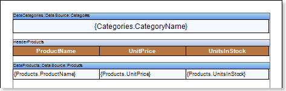
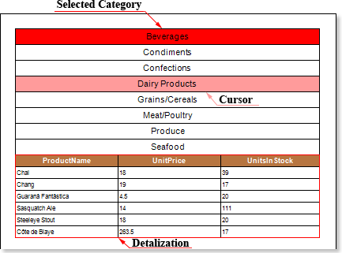

## Interactive Selection

One of the drill-down types is the interactive selection. The Interactive Selection can be used to produce data detailing on the same page, on which the main data are placed. Creating a report with the interactive selection is possible using the **Interaction.Selection Enabled** property. Only a **Data Band** has this property. Consider the example of a report using the interactive selection. Open a report with the list of categories and products related to these categories. The picture shows a report template:

Select the **Data Band** **t**o enable interactive selection. In this case, the band that contains the names of categories (the band which has a text component with the expression **Categories.CategoryName**) will be selected. Set the **Interaction.Selection Enabled** property of this selected band to **true**. After that, add a filter to the detailed band, if necessary. In this example, the filter will be added to the Data Band that contains information about products. Set a filtering expression, in this case it is **DataCategories.SelectedLine == Products.CategoryID**. Then, render a report. The picture below shows a page of the rendered report with interactive selection:

As can be seen from the picture above, the category **Beverages** was selected. This category has been detailed and displayed showing products in this category. Also, in this picture you can the category **Dairy Products** highlighted when the cursor is hovered. In addition, it should be noted that in the interactive selection the multi-level nesting may also be present.
