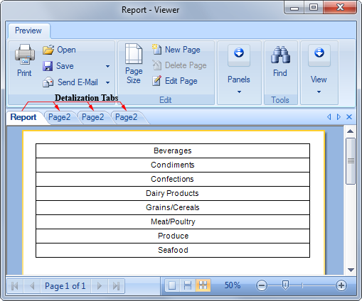
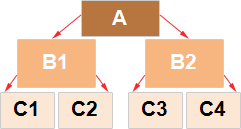

## Drill-Down Reports

In Stimulsoft Reports it is possible to create an interactive report with detailing. The report detailing refers to additional interpretation of data in the report. Usually interpretation is done when you click on any item. After that, there occurs a detailed report rendering in a new tab in the viewer. The picture below shows the viewer window with detailed tabs:

It should also be noted that the specification can be multi-level. In other words, detailing can also be interpreted, i.e. an hierarchy of detailing can be built. For example, a report with the names of categories will have details of products within a specific category. A report with products will have detailing by producers, for a particular product, etc. The picture below schematically shows the levels of detailing:

As can be seen from the picture above, a report can be interpreted as reports **B1** and **B2**. This is the first level of detailing. Reports **B1** and **B2**, in turn, have detailing as reports **C1**, **C2**, **C3** and **C4**. This is a detailing of the second level. Consider the creation of frill-down reports in more detail.
