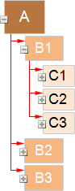
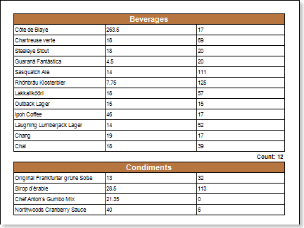
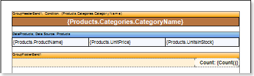
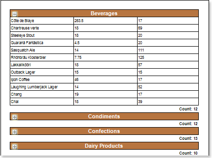

## Dynamic Collapsing

Sometimes you need to show a report in a compact form. In **Stimulsoft Reports you can find** the ability to dynamically collapse information in the preview window. A report with dynamic collapsing is an interactive report, in which collapsing blocks can expand/collapse its contents clicking the block title. Dynamic collapsing is usually used in reports with grouping, Master-Detail, hierarchical reports. Dynamic collapsing can be multilevel. Consider an example of using dynamic collapsing in the report. Let's have a report that contains a list of products that are grouped by category. The picture below schematically showed the report with a multilevel collapsing:

As can be seen from the picture, the collapsing unit **A** contains a collapsible blocks **B1**, **B2**, **B3**. This is dynamic collapsing of the first level. In turn, the block **B1** contains a collapsible blocks **C1**, **C2**, **C3**. This is dynamic collapsing of the second level, etc. Consider the example of a dynamic collapsing of the report with the group. Let's have a report that contains a list of products that are grouped by category. Below is a picture with a report with grouping:

Enable dynamic collapsing, where the title of the collapsing unit will be group titles, i.e. in this case, the category names. To do this, return to the report template (see the picture).

Select the component that will be a title of the collapsing block, i.e. in this example, the **Group Header** band. Then, set the **Interaction.Collapsed Enabled** property to **true**. In the field of the **Interaction.Collapsed** property specify an expression **{GroupLine! = 1}**. Render a report. The picture below shows a report page rendered with dynamic collapsing:

Now, when rendering a report, the group will have a look as expanding/collapsing blocks. To expand/collapse the block, you should click the title block. In this case, the group header. On the component for which the dynamic collapsing is enabled, is displayed if the block is collapsed the icon 

 is displayed and the icon 

 is displayed if the block is expanded. Note that you can collapse blocks with the the group footer. To do this, set the **Interaction.Collapse Group Footer** property to **true**.
