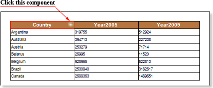
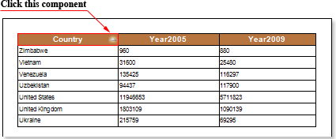
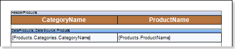
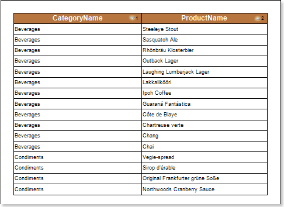

## Dynamic Sorting

In **Stimulsoft Reports** it is possible to use dynamic sorting. Dynamic sorting provides the ability to change the sorting direction in the report. Sorting the data can be performed both on a single data column as well as in several ones. Set the **Interaction.Sorting Enabled** property of the component, by clicking on which the dynamic sorting by one column will be enabled, to **true** and change the value of the **Interaction.Sorting Column** property. The value of this property is the data column, by which dynamic sorting will be done. It should be noted you can specify only one data column for one component. Then, select the component to which dynamic sorting was set. Dynamic sorting is carried out in the following directions: **Ascending** and **Descending**. Each time you click the component, the direction is reversed. The picture below shows a report page with dynamic sorting:

If you need to sort by multiple columns simultaneously, it can be done by pressing the Control button. Consider the following example. Suppose there is a report that contains the names of categories and a list of products. The picture below shows the report template:

When rendering the report without sorting, data are taken from the data source sequentially. To enable dynamic sorting you need to select the component when clicking it the sort direction will be changed. In this example, select text components in the **Header Band**. Then set the **Interaction.Sorting Enabled** properties for both components to **true**. In the fields of the **Interaction.Sorting Column** properties specify the data column to be used for sorting data. In this case, specify the column **{Products.Categories.CategoryName}** for the text component with the expression **CategoryName**, and for the text component with the expression **ProductName** specify the column **{Products.ProductName}**. Render a report. To sort data by multiple columns, you must click the components holding the **Control** button and change the sorting direction. The picture below shows a report page rendered with dynamic sorting by multiple columns:

As can be seen from the picture above, when sorting by multiple columns, the data are sorted first by the first column. In this case, the categories are sorted in the **Ascending** direction. Then, data are sorted by the second column. In this case, the products are sorted in the **Descending** direction, but within each category. In other words, in the products category **Beverages** is ordered in the direction from **Z** to **A**, in the category **Condiments**, too, from **Z** to **A**, etc. To disable sorting by multiple columns, you must release the **Control** key and click the component with dynamic sorting.
