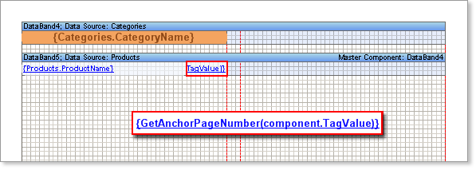
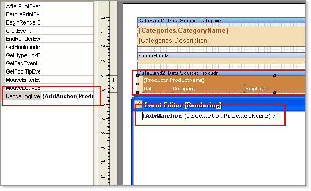
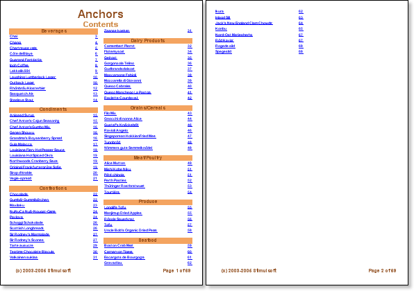

## Reports with Contents

Sometimes it is necessary to create a report with contents. In this case you should create the report structure first and then create the report on the whole. But there is a question. How to output page numbers, because at the moment, when contents rendering, numbers of pages, which elements of contents refer to, are unknown. Use the anchor in this case. The AddAnchor method is used for creating an anchor. When creating an anchor, the report generator saves the current page and compares it with the specified anchor. For example:

AddAnchor(“MyAnchorName”)

* in this line of the code a new anchor with “MyAnchorName” will be created. To get the anchor value it is necessary to use the GetAnchorPageNumber method. This method returns the number of a page according to the anchor name. If there is no the anchor with such a name the 0 is returned.

For example:

{GetAnchorPageNumber(“MyAnchorName”)}

* this text expression will return the number of a page according to “MyAnchorName”. So having an anchor name you will know the number of a page on what this anchor was created. Using these two methods a contents building is organized. The contents is built first. Instead of numbers of pages hyperlinks to anchors are pasted. For all components which call a function for getting a page number via anchor you should set the ProcessAtEnd property to true. It is necessary to do because these components are to be processed in the end of report rendering when all numbers of pages are known.

After the contents has been created the whole report rendering is in process. Anchors are created while report building. After the report has been rendered, instead of hyperlinks, the real page numbers are put on anchors in the content. Let see the anchor usage in a template. Create the Master-Detail-Detail report that shows the list of products that is split with categories. For building of such a report you should have two pages. The first page for the contents and the second for the report. On the page of the contents we put two bands. Between them we set the Master-Detail link. Then, on the Detail band, we put the text component. This ProcessAtEnd text components property should be set to true.

* **Notice:** You should enable the **ProcessAtEnd** property of the text component, which expression returns the number of a page. This property is used for the values of these text components to be processed after report rendering (when numbers of pages are known).

Specify the following text expression of the Text property:

{GetAnchorPageNumber(component.TagValue)}

* this text expression will return the number of a page using the anchor.

As an anchor name the value of the Tag property is used. For filling the Tag property the following expression is used:

{Products.ProductName}

* in this expression the name of a product is used. Therefore, it is impossible to use the expression below:

{GetAnchorPageNumber(Products.ProductName)}

The component that contains an expression will be processed in the end of report building. So the value of the Products.ProductName field will be equal for all strings – the last in a list. That is why it is necessary to remember the value of the Products.ProductName field for every string when the content is being built. For this use the Tag property. On the second page the report is built. In the Rendering property of the DataBand component (used for the content building) the AddAnchor method is called. This method will return the current page in the moment of its calling.

The anchor name is the value of the Products.ProductName field. As a result, the page number is rendered first. Then the second page is rendered and numbers of pages are saved. After the report rendering the report generator engine returns to the first page and numbers all pages.

