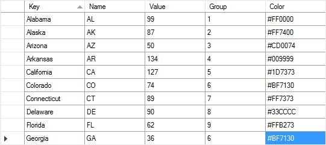
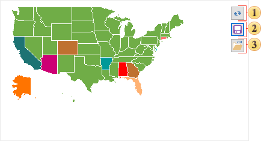
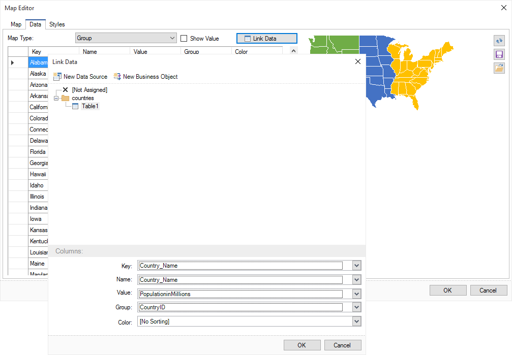

## Data for Maps

The Map component provides an opportunity to visualize the data with reference to geographical location. The data for maps can be specified manually and by passing from a data source. Consider both of these methods in detail.

To enter the values manually, you should call the map editor, go to the Data tab and fill the cells in the table below:

To draw the map, simply add the Map component to the report and specify its view, because the basic Key column is filled by default. In this case, the map carries only geographical information and will be drawn in one color. In order the map be informative, you should complete other columns:

The Name column. This column contains the name of the element. For example, the USA map contains the full name of the states as keys. In the Name column, you can specify any text that will be displayed when you hover the cursor in the rendered report. This column is not required to be filled, and, if the text is not specified, then when hovering the element in the report, the key name will be shown.

The Value column. This column contains a value for a particular map element. The value can be any number. The value will also be displayed in the rendered report when you hover the cursor, if the Show Value is enabled.

The Group column. The values ​​of this column are relevant when the map type is a map with the group, or a heatmap with the group. In this case, the group keys are specified. If you want to group some objects, you need be sure that their keys completely match. In this case, the map elements in the rendered report will be painted in one color. There will also be summed values of the group elements. The result will be displayed in the rendered report with the Total prefix, when you hover over any element of the group.

The Color column specifies the color of the map elements in the report. Color is defined by the #XXXXXX template. If the value in this column is not specified, the map element will be colored in a color map preset or custom style. If the color is specified, and the style is set for the map, the specified color will be applied to the map element.

Once the table is full, you can render a report. Also, entries can be stored in the JSON file, and can be used in reports in the future. To save the data, you should click the Save button in the map editor on the Data tab in the preview panel:

 The button to update the map in the preview panel.

 The Save button calls the menu in which you must specify the path to save the JSON file.

 The Open button calls a menu where you can select a previously saved JSON file with the map data.

In addition to manual data input, the data map can be obtained from the data source. To do this click the Linked Data button in the map editor, in the Data tab:

In the Link Data menu you can select the data source and specify the column from the data source for map fields:

The Key field indicates the data column that contains entries identical to map keys of a specific type.

The Name field specifies a column with the names of map elements.

The Value field indicates a column with values for map elements.

The Group field indicates the data column with keys for the group. In this field, you should specify the data column, if the map type is defined with the group, or a heatmap with the group. Grouped map elements in the rendered report will be painted in one color.

The Color field specifies data column with a set of colors for the map elements. If the data column is not specified in this field, the map element will be colored in a preset or custom color of the map style. If the column contains data (the map style is set) then the color from the data columns will be applied to the map element.
