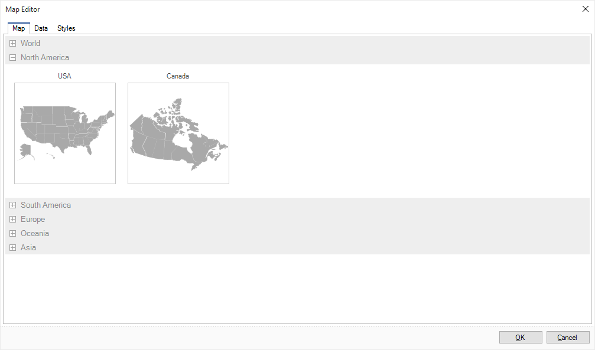
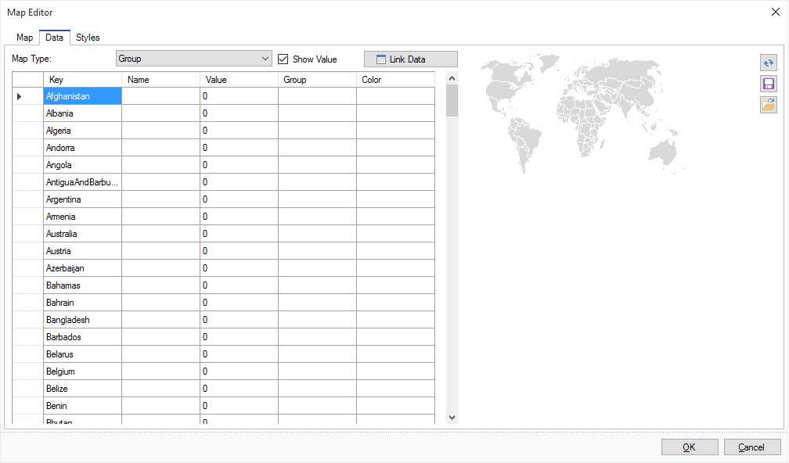
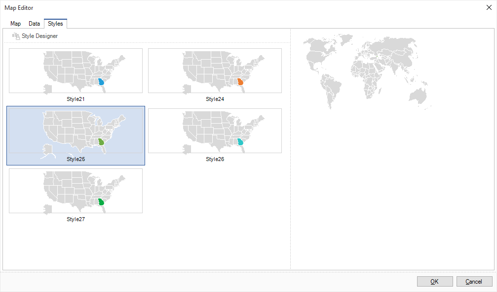

## Map Editor

Setting the map can be done in the Map component. To call the Map Editor you should double-click the component in the report template or select the Design item from the context menu of the component. The map editor will be called. It has the following tabs:

* The Map tab

On this tab, you can change the look of a future map. You can select the global or regional map. In this case, regions are grouped by continents. Depending on the type, the map will contain a variety of options:

* The Data tab

On this tab you can set the map type, the data for the map and map parameters. Data can be entered manually or derived from a data source.

* The Style tab

On this tab you can set the map style. There are some preset styles and custom styles in style designer:

