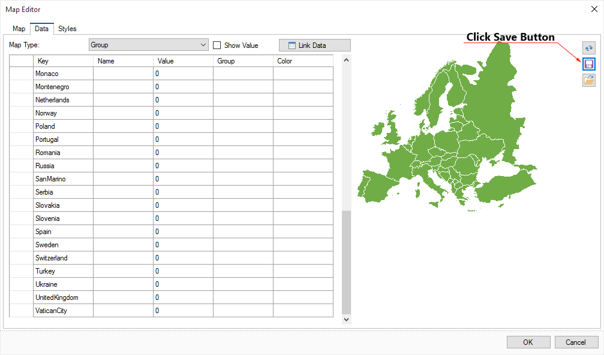

## Map Keys

A map of any type is a graphic object consisting of one or more elements. Each element has its name which is called the key. Each type of the map uses its own keys. For example, a world map has the keys like the names of countries. For the US maps, the keys are names of states. For the EU map the keys are names of the European Union countries. To change the value or color of any map element, you must specify the key. Particularly, it is taken into account when the data for the map will be obtained from the data source. In this case, entries in the data column (indicated in the Key field of a map) must be identical to particular of map keys. In other words, in the world map, country names should match the entries in the data column.

To get the map keys, select the type of a map and click Save in the Data tab of the map editor on the preview panel:

Then choose the path to save the JSON file and confirm saving. This JSON file will contain the keys of the selected map view. Now they can be integrated into your data storage.
