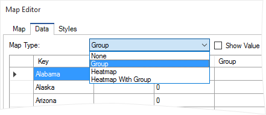
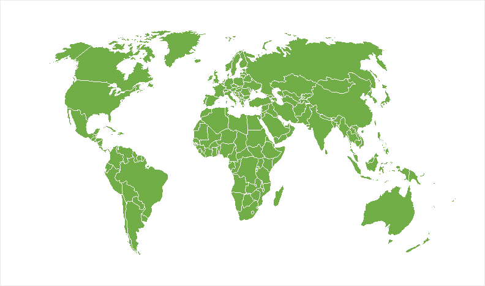
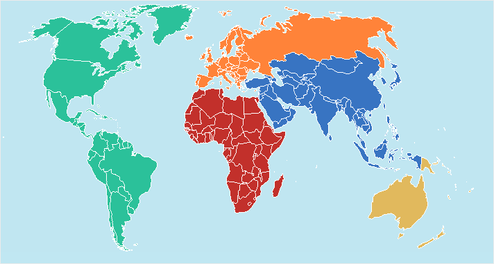
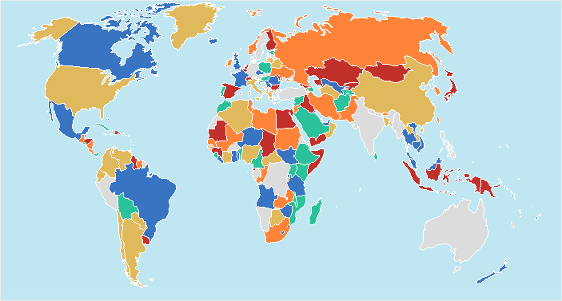
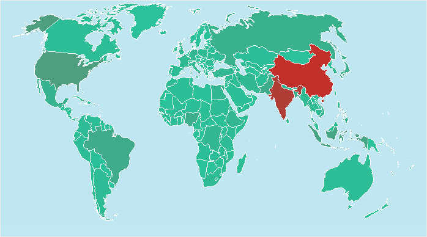

## Map Types

Maps can be with a group, heatmap and heatmap with group. You can change the type of a map in the map editor on the Data tab selecting the **Map Type** parameter:

In this case, the map, regardless of the style or color values of each key, will be filled with the base color. The map will remain to be split on items:

In this case, it is necessary to fill the Group column with data or specify data columns indication in the Group field. Each group of map elements will be drawn with one of the color map style or color that is defined for each entry:

However, if the number of colors in the map style is less than the number of groups of elements of the map, colors can be repeated:

The heatmap provides an opportunity to graphically display values of map items. Therefore, it is necessary to specify the value of map items. Also, in the style of the map, it is necessary to determine the color of the heatmap. The reporting tool, at the time of the report creation process, will check all entries or all the values in the data column. The engine will determine the maximum value and assign to it the first color of the heatmap, and the minimum value will get the second color of the heatmap style. Then, for each value in the list, depending on how close the maximum or minimum values are, shades for values will be created. The shade will be applied to the map item.

> **Video**
>
> * **Notice**: When using a heatmap, the values of groups and elements of the map will not be grouped. If you want to display the heat map by the grouped values, it is necessary to specify the type of map as the heatmap with the group.

To group the map elements and apply the heatmap to these groups, you should specify the type of a map as the Heatmap with Group. In this case, the map elements are grouped, and then the heatmap will be rendered. At the same time, it is necessary to fill the Group column or specify the data column in the Group field.
