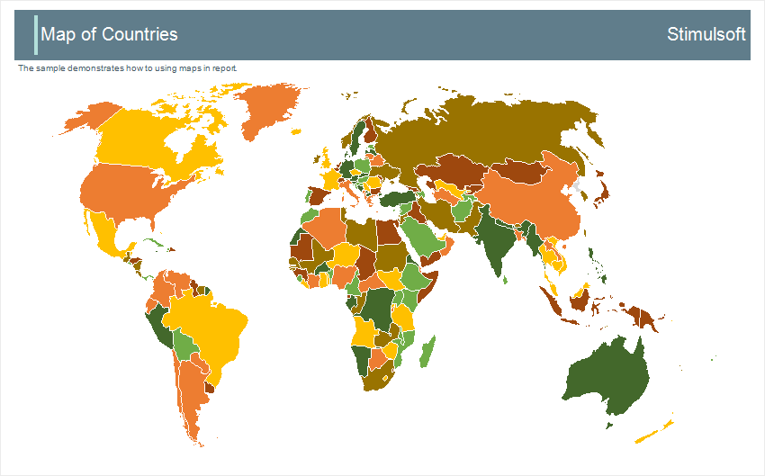

## Maps

> **Information**
>
> Watch our [videos how to create maps in the report designer](https://www.youtube.com/watch?v=VZRaUncEPb4&index=2&list=PL-72PPAq-3SUkpf2FHQXZfwV9nXi4diIa).

The Map component represents a tool to visualize data with reference to geographical location. With the help of maps, you can display various statistics for a particular region or in the world. For example, you can display the sales of any product for each state in the US or, for example, for each European country. The map may be placed directly on the page or other components like panels, bands, clones etc. Data for maps may be filled manually or obtained from the data source. The Map component can be setup in the component editor. To add the Map component in the report you should go to the Infographics menu on the toolbox or Insert tab:

* [Map Editor](Editor.md);

* [Map Types](Map_Type.md);

* [Map Keys](Keys.md);

* [Data for Maps](Data.md).
