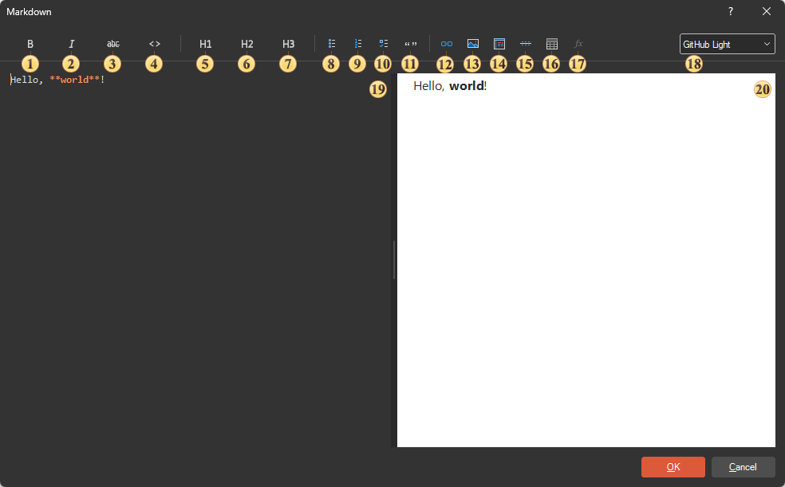

# Markdown

Markdown is a lightweight markup language that lets you format text using simple, intuitive symbols directly within plain text. A dedicated component for creating text with Markdown markup has been added to Stimulsoft reports. The component fully supports the official [CommonMark 0.31.2](https://spec.commonmark.org/0.31.2/) specification. The component is configured in its editor.


To add a **Markdown** component to the report, do the following:

* Select the Markdown component on the **Toolbox** or on the **Insert** tab in the **Components** group;

* Place this component on the report page or anywhere in the report.


Markdown settings can be found in the component editor and using the component properties. To call the editor:

* Double-click the **Markdown** component;

* Or select the Markdown component and choose the Design command from the context menu.


> **Information**
>
> For examples of text formatting with Markdown markup, [see the corresponding chapter](Examples.md).

### Markdown Editor

The Markdown component editor provides text formatting commands via controls. This lets you format text quickly and easily, including inserting tables, hyperlinks, lists, and so on. The editor also has a preview panel that displays the formatted text.





 The **Bold** button. Wraps the selected text in `**` to make it bold.

 The **Italic** button. Wraps the selected text in `*` to make it italic.

 The **Strikeout** button. Wraps the selected text in `~~` to cross it out.

 The **Code** button. Formats the selected text as inline code with ```, or as a fenced code block with ````` for a multi-line selection.

 The **Heading 1** button. Turns the current line into a first-level heading (`#`).

 The **Heading 2** button. Turns the current line into a second-level heading (`##`).

 The **Heading 3** button. Turns the current line into a third-level heading (`###`).

 The **Bullets** button. Converts the selected lines into an unordered list (`-`).

 The **Ordered List** button. Converts the selected lines into an ordered list (`1.`, `2.` ...).

 The **Task List** button. Converts the selected lines into a checklist (`- [ ]`).

 The **Blockquote** button. Marks the current line as a blockquote (`>`).

 The **Insert** **Link** button. Inserts a hyperlink in the `[text](url)` format.

 The **Insert Image** button. Inserts an image in the `` format.

 The **Code Block** button. Inserts a callout block - `> [!NOTE]`, `> [!TIP]`, `> [!IMPORTANT]`, `> [!WARNING]`, or `> [!CAUTION]`.

 The **Horizontal Line** button. Inserts a thematic break (`---`) on a new line.

 The **Table** button. Inserts a table template with a header row and a separator row.

 The **Expression** button. Inserts an expression (a data column or a variable) into the text.

 The **Theme** field. Provides the ability to change the theme of the preview panel (for example, GitHub Light). It affects the preview only, not the way the text is output in the report.

 The **editor panel** on the left. Type or paste the Markdown source here.

 The **preview panel** on the right. Shows the formatted text as it will appear when the report is viewed.

### Table of properties

See below a list of properties of the Markdown component.


| **Name** | **Description** |
| --- | --- |
| Text | Specifies the content of the Markdown component - the source text with Markdown markup. |
| Colors | A group of properties for customizing the appearance of the rendered text. By default, the built-in themes are used, but this group of properties lets you configure custom themes for text styling and formatting. |
| Editable | Specifies whether the component can be edited when viewing the report. |
| Only Text | Lets you turn off Markdown formatting. In this case, the special characters are rendered as plain text. |
| Left | Defines the left padding of the component of the report page borders. The value is defined in the units of the report. |
| Top | Defines the indent of the component from the top of the report page borders. The value is defined in the units of the report. |
| Width | Defines the width of a component in a report. The value is defined in the units of the report. |
| Height | Defines the height of a component in a report. The value is defined in the units of the report. |
| Min Size | A group of properties that defines the minimum width and height of a component in a report. The value is defined in the units of the report. |
| Max Size | Defines the maximum width and height of a component in a report. The value is defined in the units of the report. |
| Border | A group of properties that allows you to customize the borders of the element - color, sides, size, and style. |
| Brush | Defines the brush type, color, and other brush options for the background of a component in a report. |
| Margins | A group of properties used to specify the offsets of the content from the borders of this component. |
| Conditions | Calls the conditional formatting editor of reports. |
| Component Style | Selects the style that will be applied to the component in the report. |
| Use Parent Styles | Uses the style of the report component to which the current component belongs. |
| Anchor | Specifies how the current component's position will snap to the parent component's dimensions. |
| Can Break | This property determines whether the component can break content across multiple pages. |
| Can Grow | Automatically increases the height of a component. |
| Can Shrink | Automatically reduces the height of a component. |
| Dock Style | Sets the docking mode of the current component with others. |
| Enabled | Enables or disables processing of the current component when rendering a report. |
| Grow to Height | Automatically changes the height of the current component, depending on the height of the parent component. |
| Interaction | Defines interaction settings for the current component when viewing a report. |
| Printable | Defines the behavior of the component when printing - whether to print it or not. |
| Print On | Determines the print mode of a component. |
| Shift Mode | Determines the offset mode of a component, depending on the behavior of the above component. |
| Name | Changes the name of the current component. |
| Alias | Changes the alias of the current component. |
| Restrictions | Configures the permissions for using the current component: The **Allow Change** option enables or disables changes of the component. If checked, the current item can be changed. The **Allow Delete** option enables or disables the deletion of a component. The **Allow Move** option allows or prohibits moving a component. The **Allow Resize** option enables or disables resizing of a component. The **Allow Select** option enables or disables the component selection. |
| Locked | Enables or disables resizing and moving the current component. If the property is set to **True**, then the current component cannot be moved or resized. If this property is set to **False**, then this component can be moved and resized. |
| Linked | Binds the current location to a report page or other component. If the property is set to **True**, then the current component is linked to the current location. If this property is set to **False**, then this component is not linked to the current location. |
