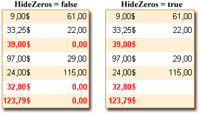

## Ignoring Null Values

Often, when the numerical information is printed then it is required to ignore the zero values. In other words it is necessary do not show print them at all. The **HideZeros** property is used for this. It is necessary to set this property to **true**, and the **Text** component will not print zero values. The picture below shows an example without using this property (**left picture**) and using the property (**right picture**).

