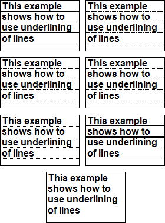

## Lines of Underlining

If it is necessary to underline the **Text** component with horizontal lines, then it is possible to use the **LinesOfUnderline** property of the text component. Using this property it is possible to select style of underlining. If to select the **None** style, then there will not be any underlining.

