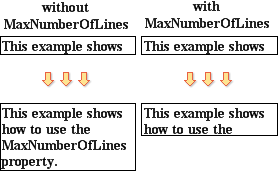

## Maximal Number of Lines

How to make the **Text** component, when increasing the vertical size, increase it on the maximal number of horizontal lines? Use the **MaxNumberOfLines** property. By default, this property is equal in zero and the component will be increased vertically. The component increasing is limited in page size. If you set the value of this property in 5, then, when increasing the vertical size, it will be increased in 5 horizontal lines.

