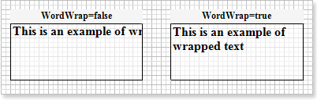

## Multiline Text

If the text cannot be put on one line it will be trimmed by default. If it is required to put a text on some lines, then you should set the word wrap. You should set the **TextOptions.WordWrap** property of the **Text** component to **true**. When the text is wrapped on a new line, vertical and horizontal alignments are used.

