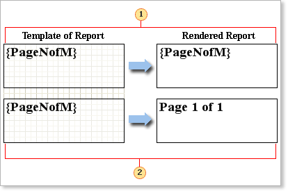

## Output Text Only without Taking Expressions into Consideration

How to get an expression to be output "as is", without code processing? Set the **TextOnly** property to **true**, and all the expressions will be output as a text. No calculations will be made.

 The **TextOnly** property is set to **true**. The text is output "as is", without processing of expressions.

 The **TextOnly** property is set to **false**. The text is output with processing of expressions.
