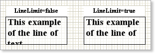

## Prevent Showing Incompletely Visible Lines

Often it is necessary to output text and do not show vertically trimmed lines on the bottom of a component. If to set the LineLimit property to true, then only full lines will be output. Absence of additional line may change the word wrap.

