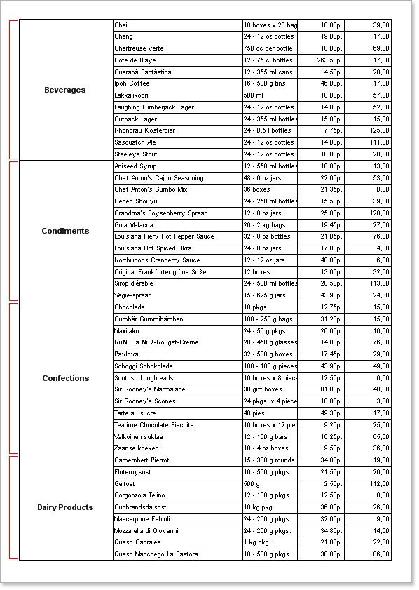
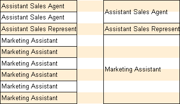
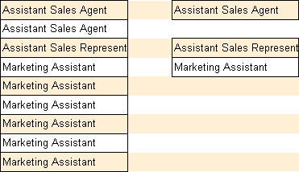
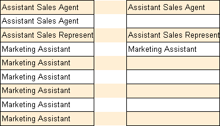

## Processing Duplicates

In many reports there is a necessity to join a few Text components in one which contain duplicated values. The ProcessingDuplicates property is used for this. It should be set to true.

See the picture below how repeated text values are joined.

In many reports, If these components contain duplicate values, then it is necessary to combine some Text components in one. To combine duplicate values it is necessary to use the ProcessingDuplicates property.

The picture below shows an example of duplicate text values.

The ProcessingDuplicates property makes it possible to combine duplicate values as follows: Merge, Hide, RemoveText, GlobalMerge, GlobalHide, GlobalRemoveText. Next, look at examples of this property.

Merge - In this mode, the text components with identical values are merged into a single text component.

Hide - In this mode, the first text component remains on its place without changing the size. The rest of the text components are removed from the report.

Remove Text - In this mode, the first text component remains in place without changing the size. The rest of the text components to remain in their seats, but they removed the text content.

Combining the components with the same value is taken into account in the name of the components of a report template. If suddenly one of the other two will be exactly the same text component with the same text values, but they will have different names, then those components will not be merged. To avoid this limitation you need to use the GlobalMerge, GlobalHide, GlobalRemoveText. They worked the same way as described above regimes, but it does not take into account the names of the components.
