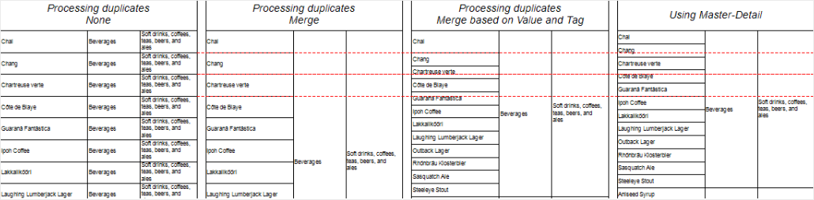

# Processing Duplicates

In many reports, it is necessary to process duplicate values. For example, multiple instances of the **Text** component can be merged into a single one if they contain identical values. To achieve this, use the **Processing** **Duplicates** property of the Text component.

Main Property Modes

The table below describes the primary modes available for duplicate processing.

| **Name** | **Description** |
| --- | --- |
| **None** | No duplicate processing is performed. All elements are displayed in the report unchanged, even if they contain identical data. |
| **Merge** | Combines adjacent elements with identical content into a single block. |
| **Hide** | Leaves the first occurrence unchanged and hides all subsequent adjacent elements with duplicate content. |
| **Remove Text** | Leaves the first occurrence unchanged and removes the text from all subsequent adjacent elements with duplicate content. |

An example of duplicate text value processing is shown below

| **None** | **Merge** | **Hide** | **Remove text** |
| --- | --- | --- | --- |
| Item | Item | Item | Item |
| Item |  |  |  |
| Item |  |  |  |

In most cases, these basic modes are sufficient. Additional (advanced) modes are typically required only for more complex report structures or when specific duplicate-processing requirements need to be met.

Additional (Advanced) Property Modes

The advanced processing modes include the modifiers Global and/or BasedOnXXX in their names. Let’s review these modes one by one.

### Global Modes

By default, duplicate values are processed separately for each component. Only instances of the same component (identified by name) are compared. For example, if two text boxes with identical text values are placed one below the other but belong to different components, they will not be merged. However, in reports with more complex structures, it may be necessary to bypass this limitation. In such cases, use the modes whose names contain the word Global: **Global Merge**, **Global Hide**, and **Global Remove Text**. These modes work exactly like their standard counterparts described above, but component names are ignored during duplicate detection.

### Based On Tag Modes

Situations often arise where duplicate values should not all be merged together, but only within a specific context or according to certain criteria. For example, in the table below, sales of items are shown for several days, and identical items should be merged only within the same day. Standard modes merge all consecutive duplicates based solely on the text box content, without taking any other factors into account. In such cases, modes whose names contain the word **BasedOnTag** should be used. These modes perform duplicate processing based not on the text box content, but exclusively on the value of its **Tag** property. The **Tag** property can contain a complex expression that takes multiple criteria into account, allowing duplicate processing to be customized for specific scenarios.

| **Date** | **Items** | **Expected** | **Merge Based on Tag** | **Merge** |
| --- | --- | --- | --- | --- |
| 1.05.2026 | Item 1 | Item 1 | Item 1 | Item 1 |
| Item 2 | Item 2 | Item 2 | Item 2 |  |
| Item 2 |  |  |  |  |
| 2.05.2026 | Item 2 | Item 2 | Item 2 |  |
| Item 1 | Item 1 | Item 1 | Item 1 |  |
| Item 1 |  |  |  |  |
| 3.05.2026 | Item 1 | Item 1 | Item 1 |  |
| Item 1 |  |  |  |  |

For example, suppose the second column displays an item name using the expression `{dataSource.ItemName}`, while the first column displays a date using `{dataSource.Date}`. If the date should be used as the grouping criterion, the following expression should be assigned to the **Tag** property of the text component: `{dataSource.ItemName}{dataSource.Date}`. In other words, the expression displayed in the component is combined with expressions representing the grouping criteria from preceding columns. As a result, duplicate values are merged only within the specified criteria.

### Based On Value And Tag Modes

Now let's discuss the most complex part - the modes whose names include the **BasedOnValueAndTag** modifiers. First, it is important to understand that all other modes operate only during the report post-processing stage. In other words, the report is generated in its entirety first, and only then does the engine iterate through the report pages, search for duplicate values, and process them. As a result, after duplicate processing is completed, the positions and sizes of components remain unchanged.

For example, in the illustration below, the third column contains category descriptions. Some descriptions are long and occupy three lines of text. After a standard cell merge operation, the cell sizes remain unchanged. Each text row still occupies the same amount of space, and the merged cell retains a large overall height.

Therefore, modes have been added that process text components in two stages. The first stage is an additional step performed during the calculation of the text component value (in the **OnGetValue** event). At this stage, when a duplicate is detected, the content of the text component is immediately cleared, reducing its height to the minimum. This directly affects the size of the text component and, consequently, the height of the row. The second stage, as in the other modes, processes the components after the entire report has been rendered. At both stages, the text component value and the value of its **Tag** property are used.

> **Information**
>
> The first occurrence of a duplicate value always retains its content and therefore keeps its full height. Only subsequent duplicate components are reduced in height. This is a limitation of the reporting engine and cannot be changed. If the height of the first row must also be reduced, consider alternative approaches, such as redesigning the report structure and using a master-detail relationship.

The table below provides a complete list of duplicate-processing modes.

| **Name** | **Description** |
| --- | --- |
| **None** | No duplicate processing is performed. All elements are displayed in the report unchanged, even if they contain identical data. |
| **Merge** | Merges adjacent elements with identical content into a single block. |
| **Hide** | Leaves the first occurrence unchanged and hides all subsequent adjacent elements with duplicate content. |
| **Remove Text** | Leaves the first occurrence unchanged and removes the text from all subsequent adjacent elements with duplicate content. |
| **Merge based on Tag** | Merges adjacent elements that have the same **Tag** property value. |
| **Hide based on Tag** | Leaves the first occurrence unchanged and hides all subsequent adjacent elements that have the same **Tag** property value. |
| **Remove Text based on Tag** | Leaves the first occurrence unchanged and removes the text from all subsequent adjacent elements that have the same **Tag** property value. |
| **Global Merge** | Merges duplicate elements even when they belong to different components. |
| **Global Hide** | Hides duplicate elements even when they belong to different components. |
| **Global Remove Text** | Removes text from duplicate elements even when they belong to different components. |
| **Remove based on Value Text** | Leaves the first occurrence unchanged and removes the text from all subsequent adjacent elements with duplicate content. |
| **Merge based on Value and Tag** | Merges adjacent elements that have both identical content and the same **Tag** property value. |
| **Hide based on Value and Tag** | Leaves the first occurrence unchanged and hides all subsequent adjacent elements that have both identical content and the same **Tag** property value. |
| **Global Remove based on Value Text** | Clears text in duplicate elements based on the Tag value, even when the elements belong to different components. |
| **Global Merge based on Value and Tag** | Merges adjacent elements that have the same **Tag** property value, even when they belong to different components. |
| **Global Hide based on Value and Tag** | Leaves the first occurrence unchanged and hides all subsequent adjacent elements that have the same **Tag** property value, even when they belong to different components. |
