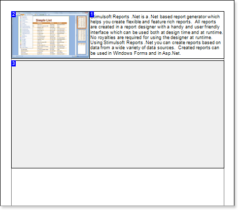
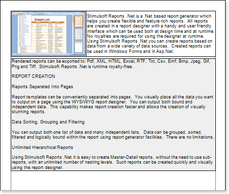

## ReportTo Property

The **ReportTo** property of the **Text** component is used for synchronous output of a message in two text components. The message is specified in the first text component. Then, in this text component, in the **ReportTo** property, the second text component, on which message output will be continued, is specified. If the space in the first component is not enough for the message output, then this message will be continuing to output in the second component. You should consider, that in the first component, whole number of vertical visible lines will be output. In the second component the message will be continuing to output starting with the end of the message of the first component. You should know that for the correct work of this function you have to create the first component and then the second one. If there was another order of creation of components you may use commands of components order.

The result can be seen on the picture below.

The **ReportTo** property makes it possible to work only with components that are located on one level - such as a bands.
