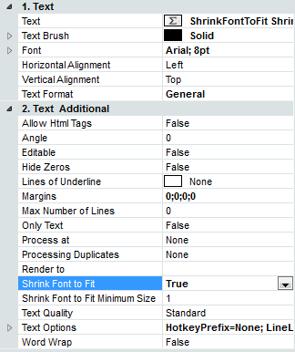
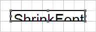
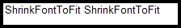
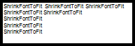

## Shrink Font To Fit Property

The **Shrink Font To Fit** property of a text component is used when it is necessary to adjust the height of the text to the size of the text component. This property can be found on the Properties Panel.

The property can take two values​​: **true** and **false**, respectively, that means the property is enabled or disabled. By default, the property is set to false.

The picture below shows a component with the text, which is clearly larger than the size of the component.

When the **Shrink Font To Fit** property is set to **false**, the text in the viewer will look like on the picture below

When the **Shrink Font To Fit** property is set to **true**, the text in the viewer will look like on the picture below

* **Notice:** The Shrink Font To Fit is a post-processing property and this should be taken into account when adjusting the text component. If you enabled CanBreak and CanShrink properties, then, when rendering a report, the text component will take a size corresponding to the height of the text on the basis of preset font size.

**CanBreak** and **CanShrink** properties are disabled, but **Shrink Font To Fit** is set to **true**

**CanBreak** and **CanShrink** properties are enabled, but **Shrink Font To Fit** is set to **true**

