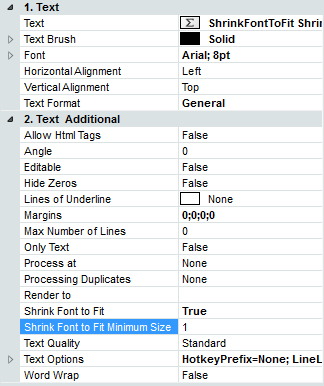
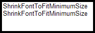
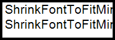

## Shrink Font to Fit Minimum Size Property

The **Shrink Font to Fit Minimum Size** property of the text component is used to adjust the minimum size of the font to which the text should be reduced. This property can be found on the Properties Panel.

Images below show how this property works

The **Shrink Font to Fit Minimum Size** property is set to **1**. The font **Arial**, size **8pt**

The **Shrink Font to Fit Minimum Size** property is set to **4**. The font **Arial**, size **8pt**

* **Notice:** Works in association with the **Shrink Font To Fit** property set to **true**.
