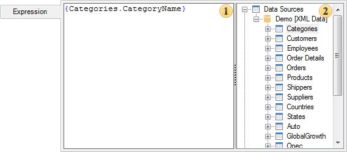
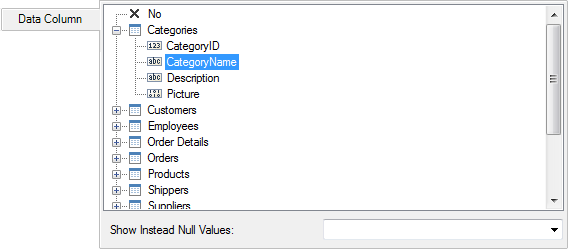
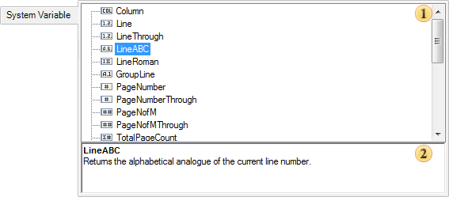
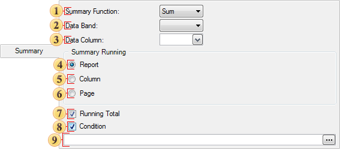

## Text Editor

Editing text components can be done in the Text Editor. This editor contains several tabs in which you can change an expression of the text component, select a column, system variable, specify the calculation results.

* The tab Expression

In the tab Expression, you can specify a text, expression, reference to any item in the data dictionary:

This tab has the following panels:

 The panel Text where you can directly specify a text of the expression, reference to an item in the data dictionary.

 The panel Data Dictionary contains items of a report data dictionary. It also supports Drag and Drop of items from the panel  to the panel . At the same time, a reference will be automatically generated on the data dictionary item. In the picture above you see that the expression {Categories.CategoryName} is a reference to the description of the data columns CategoryName (data source Categories) in the report data dictionary.

* The tab Data Column

This tab is represented by a single panel, which displays only the data columns from the Dictionary. When you select a column, an expression will be formed. This expression is a reference to the description of this column in the report data dictionary. Also on this tab you may find parameter Show Instead Null Values​​, using which you can specify the characters to be displayed instead of the zero values ​​of selected data columns.

* The tab System Variable

This tab has the following panels:

 The panel **System Variable**. This panel displays all the system variables of the data dictionary. A system variable is selected here, which will form the reference in the text component.

 The panel **Descriptions**. This panel displays a description of the selected variable.

* The tab **Summary**

On this tab, you can create an expression that calculates summary. The result of it will be displayed in this text component:

 In this drop-down list you may determine the type of an aggregate function (operation) to calculate the summary.

 In this drop-down list you can select the data band by which the summary will be calculated.

 This list defines the data column, the values ​​of which will be calculated totals.

 This radio button sets the calculation function for the entire report. The value of the function in the any place of the report will be the same.

 This radio button sets the calculation of the functions of the data column.

 This radio button sets the calculation of the function by a report page. On each report page the total value will be calculated only on the page.

 The checkbox sets the calculation mode with the running total. Each subsequent result includes all the previous ones.

 The checkbox Condition allows you, when calculating totals, to take into account the value only when executing a certain condition.

 The field is used for the condition expressions. Available when the checkbox Condition is enabled.
