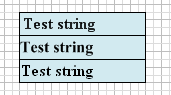
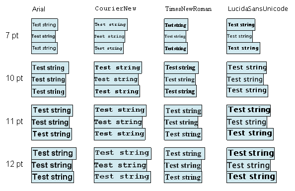

## Text Quality

The StiText component and components, inherited from it, have the **TextQuality** property. This property allows selecting/displaying the quality of the text. The property may have one of three values​​:

* **Standard.**

* **Typographic.**

* **Wysiwyg.**

In the **Standard** and **Typographic** modes, text displaying is performed using a **GDI +** system library. The difference between these modes is that in the **Typographic** mode, a text is output with antialiasing and looks fine, but the rendering is slow. In the **Wysiwyg** mode a text is displaying using the GDI system library. The text in this mode may not look as beautiful as in the other two modes.

Why do we need GDI, if GDI +  exists and it is more beautiful and easy to use? To answer this question, lets turn to the definition of the **WYSIWYG**.

**WYSIWYG** (acronym for "What You See Is What You Get") is a way of editing, in which the content in the process of editing looks very similar to the final output. With regard to the reporting tool, this means that the report should look the same when editing a template, and viewing the finished report printed on paper. However, in practice, it is not so simple. Many methods can display a text in different ways on different monitors and in different ways to print it on different printers. This is particularly evident in a large text: when viewing in the preview with different zoom modes and printing, line breaks can be located in different places. This occurs due to many reasons. In the GDI + system library, most of these problems have been solved, but not all, and sometimes inaccurate displaying still occur. To solve the remaining problems one need full control of the text output. GDI + does not provide such control. Therefore, the **Wysiwyg** mode was added. In this mode a text is output using the GDI. GDI methods allow you to control the output of each character of a text. This can eliminate almost all the problems. Thus, the **Wysiwyg** mode displays the text not as pretty as the other two methods, but more accurately.

There is another difference between these two modes: as a text in each mode is displayed in different ways, then the measurement of length of a line is done in different ways. For example, we have three text boxes with the "Test string" text; set the **TextQuality** to **Standard** for the first text box, to **Typographic** for the second one, and to **Wysiwyg** for the third. Set the **AutoWidth** property to true for all the text boxes. In the design mode of the report we get the following:

By sight the difference between these lines is not visible. However, after rendering, the width of the text boxed will be calculated depending on the width of the text, and we will immediately see the difference between the modes:

In the above picture it is clearly seen that for different types and sizes of fonts completely different results are obtained. This must be taken into account, for example, if you are going to use the Cross-Tab component. In this component the table columns widths are fit depending on text, and, in different modes, the width of the table can be changed.

In the above picture clearly shows that for different types and sizes of fonts are obtained completely different results. This must be taken into account, for example, if you're going to use the component CrossTab: this component width of the table columns to fit text, and different modes the width of the table can pretty much change.

Also, as practice shows, WYSIWYG in these applications are often not working properly. For example, your report in EXCEL in edit mode and in print preview may look different. Even more differences you will see if in edit mode will begin to change the page scale from 50% to 200%: at 100% scale text can be placed in a cell at 50% did not reach the cell edge, and at 200% the last word can be transferred to the next line. Another example - a multi-line text: with different scale is not always correct calculated line spacing, and height of text in a cell can vary. At one level in the cell can not fit all the text strings, ie truncate the text. At another level the same text can be compressed, and the bottom of the cell will remain blank. Even a team of Excel "Autofit row height" may give unpredictable results, especially in small fonts.

Therefore, when you export reports in MS-Office, we recommend using some of the techniques described below. Recommendations can be divided into two parts: general guidelines for preparing reports and recommendations for each export.

General recommendations on export reports in MS-Office are to design a report template:

Try whenever possible to keep the gap between the end of the line and the edge of textbox, in which case the problem should not arise;

It follows from the preceding paragraph: Do not use unnecessarily property AutoWidth, as the size of textbox in this case is calculated without gap;

pick a value for the text TextQuality, to a line of text to receive the most long and this will increase the likelihood that the text after export will appear normally.

Recommendations for the export of reports in MS-Word

When exporting to MS-Word Use the following trick: for each line of text font is installed seal. The value of the density of the font is measured in units of twips and stored in a static property StiOptions.Export.Rtf.SpaceBetweenCharacters (StiOptions.Export.Word2007.SpaceBetweenCharacters). By default, the property is set to -2. On the eye, this quantity of text compression is not noticeable, but in most cases it is enough. If necessary, this value can be changed. Zero value of the property corresponds to the normal font, positive values ​​correspond to the sparse font.

Recommendations for exporting reports to MS-Excel

When exporting to MS-Excel use the following trick: for all the problem textbox is recommended to set the right / or left border of textbox. Table cells in Excel do not have borders, so the border will be considered only when rendering the textbox as garantiroovanny gap. Border textbox sets the Margins, the value specified in hundredths of an inch. For most cases it is sufficient to establish the right boundary is equal to 1 one hundredth inch (written in the property 0, 1, 0, 0).
