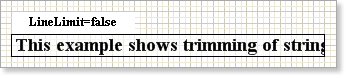
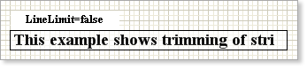
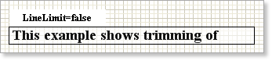
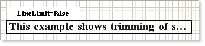
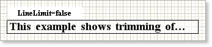
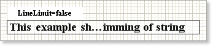

## Trimming in the End of Text Line

If there is not enough space to put whole text line in the text component, then, using the **TextOptions.Trimming** property, it is possible to customize text trimming. It has the following values:

**None** - the text is trimmed strictly by the edge of a text component or, if it is a multiline text, by the last visible word;

**Character** - the line is trimmed after the last visible character;

**Word** - the line is trimmed by the last visible word;

**Ellipsis Character** – last characters of a word are changed on omission points;

**Ellipsis Word** - omission points are added after the last visible word;

**Ellipsis Path** - the middle of a line is changed to dots so as the beginning and the end of a text line can be visible.

