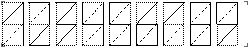
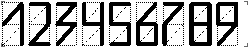

## Zip code

Zip code is used for mailing, to facilitate sorting. Stimulsoft Reports has a special component to display this code. It is called the Zip Code component. It can be placed on components, bands and pages. Setting the values of this component is possible by means of the Code property. This value of the property can be any character, but the Zip Code component can only display numbers. The picture below shows a zip code with numbers "123456789":

To increase the font size, change the value of the Size property, specifying the size with numbers, the higher the value is, the thicker is the width of the elements. The picture below shows a zip code with an increased width:

