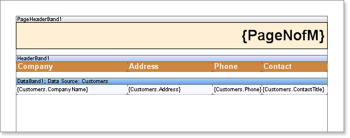
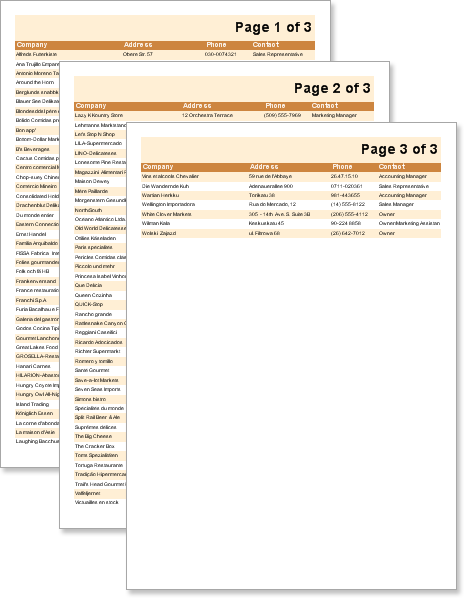

## Page Header Band

The Page Header band is used to output information such as page numbers, dates, and company information at the top of a page. The Page Header band is output at the top of every page of the report.  An unlimited number of Page Header bands can be placed on a page.

* **Note:** The number of Page Header bands that can be placed on a page is effectively unlimited other than by available space.

**Example**

Create a new report and drop three bands on a page: a Page Header band for the current page number and number of pages in the report, a Data band to output data and a Header band band to output data column headers. Drop a text component on the Page Header band and enter the following expression in the Text Property Editor:

{PageNofM}

* **Note:** If you prefer instead of typing the expression it is possible to select it from the System Variables in the Expression Editor.

The result should look something like this:

Now run the report, and you will see that the page number is printed at the  top of each page.

