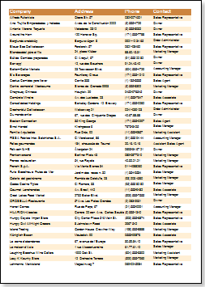
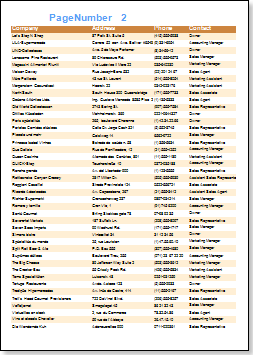
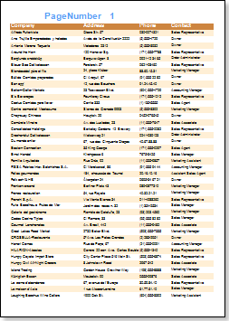
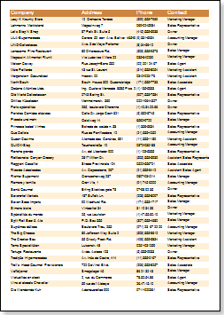

## PrintOnEvenOddPages Property

The PrintOnEvenOddPages property is used to print headers and footers on even/odd pages, for Page Header bands and Page Footer bands.

The picture above shows a sample of a report with the PrintOnEvenOddPages property of the Page Header band set to EvenPage.

The picture above shows a sample of a report with the PrintOnEvenOddPages property of the Page Header band set to OddPage.

Three values are available for this property:

 Ignore. Bands are printed on all pages;

 PrintOnEvenPages. Bands are printed on even pages;

 PrintOnOddPage. Bands are printed on odd pages.
