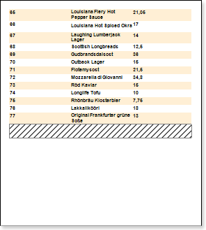
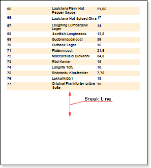
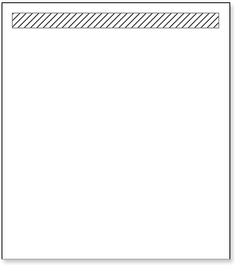
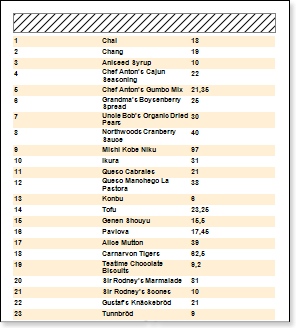
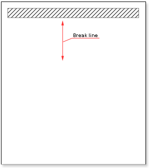
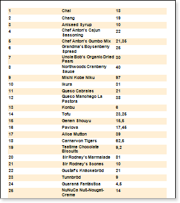

## Page Break

**NewPageBefore property**

To break and insert a new page before a certain band you can use the **NewPageBefore** property. If the property is set to **false** for the band, then the report generator reaching this band will output it after the previous band without generating a new page. The picture below shows the **Footer** **band** that is output immediately after the **DataBand**:

If the **NewPageBefore** property is set to **true**, then the report generator at the time of the rendering a certain band, will make a gap (so that the band will be output on a new page), and on the previous page data output will be finished, despite the availability of free space on the page. The picture below shows, the **Footer** **band** which the **NewPageBefore** property is set to **true**:

It is necessary to consider that the new page first displays all service bands (Page Header Band, Page Footer Band, Header Band). Also, when rendering a new page, the report generator will take into account the value of the following properties: **Break if Less Than** and **Skip First**.

**NewPageAfter property**

Also, you can create a break and insert a page after a certain band. This can be done with the **NewPageAfter** property. If this property is set to **false** for the band, then the report generator when comes to render it will not do the gap, and immediately after it the other bands will be built. The picture below shows, the Header band that is output before the Data band:

If the **NewPageAfter** property is set to **true**, then the report generator will render the band, which property will generate the new page. The next band, will be output on a new page. The picture below shows, the Header band which the **NewPageAfter** property is set to **true**:

