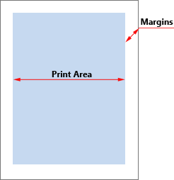
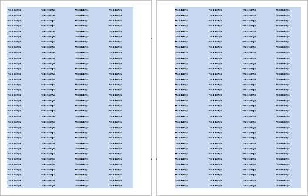
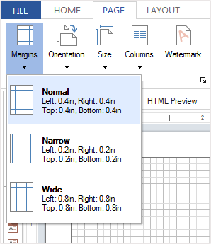
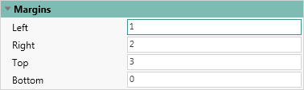

## Margins

When you print a report, it is common to encounter situations where the printer is unable to print to the edges of the paper, resulting in a loss of information. In other words, the page may have maximum text content, but due to the technical limitations of the printer, some information at the edges will not be printed. To avoid such issues, you should set report margins. Margins help divide the printable area and the remaining empty space around the edges of the page, known as fields.

> **Information**
>
> **Information:** Borders in the created report are not displayed. The page consists of the print area and margins.

Generally, text and other report elements are placed in the print area. However, you can also place elements on the margins. For instance, you can use the text component to display the page number. The size of the fields can be adjusted by selecting one of the preset options or by setting them according to your preferences. You can choose preset field options by navigating to the **Page** tab -> **Margins** menu. Alternatively, custom fields can be defined using the **Margins** report property.

> **Video**
>
> **Notice**: The units of the fields correspond to the units of the report, such as centimeters, millimeters, inches, or hundredths of inches.

Sometimes, when creating a report to be stapled in a book, you may need to have a wider margin on one side of the page.

As seen in the picture, the right margin of the left page is wider than the left margin, while the left margin of the right page is wider than the right margin. This arrangement allows for pages to be stapled in a book. The placement of fields in consecutive pages, as shown above, is referred to as a mirror arrangement of margins. To activate the mirror margins, you need to set the **Mirror Margins** property to **true**.

> **Information**
>
> **Information**: If the margins have the same values (right margin is equal to the left), their mirrored margins will be the same.

Now consider the example of setting margins. Predefined fields can be changed on the **Page** tab with help of the **Margins** command.

> **Information**
>
> **Information**: In some types of interfaces, the Page tab may be missing. In such cases, only one default margin size is set, and no other preset fields are available.

The customization of fields is done through the property panel. Depending on the type of interface, there may be a single **Margins** property. In this case, the values of the properties will consist of four numeric values, starting from 0 or greater, separated by a semicolon (;).

In some types of interfaces, the **Margin** group of properties will be located, where each margin is treated as a separate property.

To activate the mirror fields, you should set the **Mirror Margins** property to **true**.

> **Video**
>
> **Notice**: The minimum size of margins depends on the printer used, the printer driver, and the paper size. For information regarding the minimum size of margins, please refer to the user manual of your printer.
