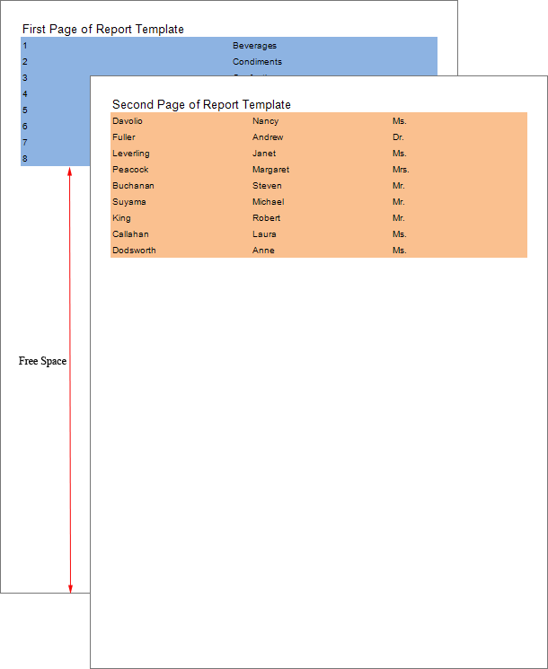
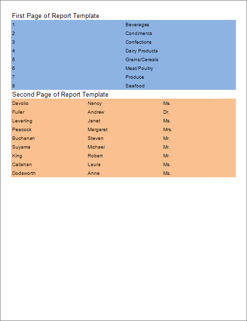

## Print On Previous Page Property

The pages of a report template are processed and printed sequentially. The first page of the template is processed first, followed by the second page, and so on. The processing order of pages can be found on the **Report Tree** tab, where the higher the page is in the tree, the higher its processing priority. In the case of page copies, the original page is processed and printed first, followed by its copies. It is important to note that the construction of a report template page begins on a new page in the rendered report. For example, if the first page of the report template extends to 14 and a half pages, the construction of the second page of the report template will start from the 15th page in the rendered report.

As shown in the picture, after processing the data from the first page of the template, there is excessive free space on the output page. The data from the second page of the report template is printed on a new page. To ensure that the data from the second page of the report template is printed immediately after the content of the first page, you need to set the **Print On Previous Page** property of the second page in the template to **true**.

By default, the **Print On Previous Page** property is set to **false**.
