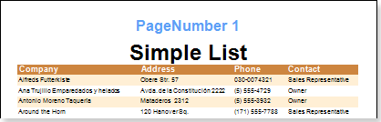

## Page Number

Let see page numbering using the **PageNumber** system variable. When using this variable, the page number will be displayed on each page. Place where the page number is shown depends on which band is the text component, in expressions of what the system variable is used.

On the picture above the **PageNumber** system variable was used on the **Page Header** band. System variable can be used in any text component. The text component can be placed on any page band.
