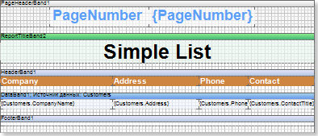
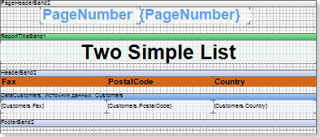
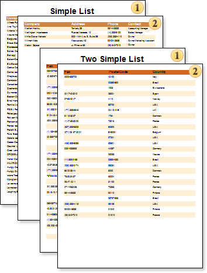

## ResetPageNumber Property

The numbering of the pages of the report begins with the number 1 and is defined consistently for each page built by the report.

On the picture above the first page of a template is represented.

On the picture above the second page of a template is represented.

If, when report rendering, the ResetPageNumber is set to  false, then numeration will look like on the picture below:

If the set the ResetPageNumber page property to  true, then numeration for each page of a template will start from 1:

* **Information:** The **ResetPageNumber** property works with the following variables: **PageNumber**, **PageNofM**, **TotalPageCount**. With system variables: **PageNumberThrough**, **PageNofMThrough**, **TotalPageCountThrough** - this property does not work.

By default the property is set to false.
