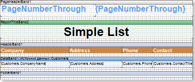
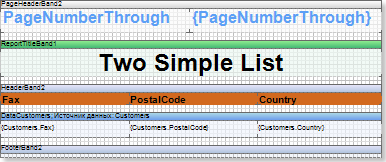
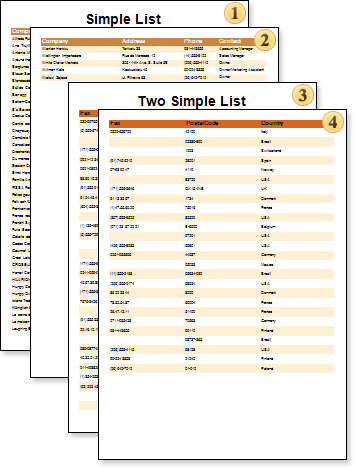

## Sequentially Numbered Pages

Sequential numbering (numbering without taking into account the ResetPageNumber property) set the SystemVariables:

* {PageNumberThrough} - PageNumberThrough, displays the page number;

* {TotalPageCountThrough} - TotalPageCountThrough, displays the total number of pages of the rendered report;

* {PageNofMThrough} - PageNofM, is a combination of PageNumberThrough and TotalPageCountThrough, and displays the page number in relation to the total number of pages in the rendered report..

The picture above shows the first page of the report template.

The picture above shows the second page of the report template.

After rendering a report, even if the ResetPageNumber property of the page is set to true, the numbering of pages of the rendered report is to be consistent.

In other words, if the ResetPageNumber property is set to true, then, when using the system variables, mentioned above, the numeration will not be reset. So it will continue to be consistent for each page of the rendered report.
