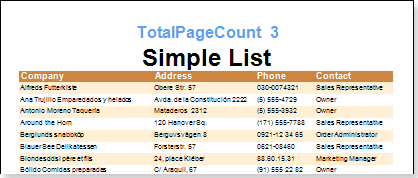

## Total Page Count

The **TotalPageCount** system variable is used to output the total number of pages.

On the picture above you can see how total number of pages is output. The **TotalPageCount** system variable is used with the **PageNumber** system variable. Usually it looks like this:  **{PageNumber} Of {TotalPageCount}**. For example, **5 of 10**.
