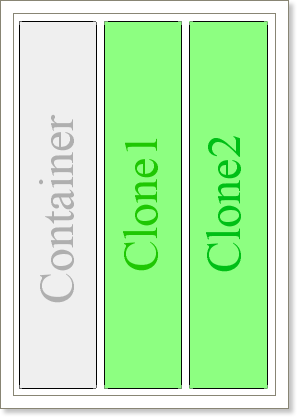

## Cloning

The unique Clone component is included into Stimulsoft Reports. This component is used to clone parts of a report into a required part of a report. Cloning can be used only in panels.

* **Notice:** The Clone component can work with the Panel component.

How it works? Put a panel on a page. Put bands to output lists. Place a panel on the left part of a page. Place a **Clone** component on the right side of a page. Then, in the **Clone** component designer, indicate the panel that should be cloned. In our case it is the panel that was created on a page.

Run a report. The panel will be rendered first. The list will be output on the left side of a page. Then the list will be continued to output on the place where the **Clone** component is placed. The **Clone** component clones all bands of the panel. Using the **Clone** component it is possible to render complex reports with columns. The first column is output using the panel and other columns - using the **Clone** component. It is important to consider the order of placing Clone components on a page.

* **Notice:** Panel components and their clones will output in order of placing components on a page.
