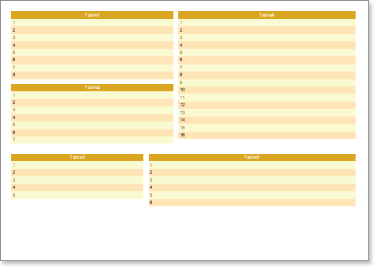

## Multiple Tables on One Page

Sometimes it is required to output multiple tables on a page and, what is very important, to output them on different parts of a page. Such report can be rendered using the **Sub-Report**. But it is much easier to do this using panels. All it is required to do is to place panels and put band on them. On the picture below a sample of such a report is shown.

