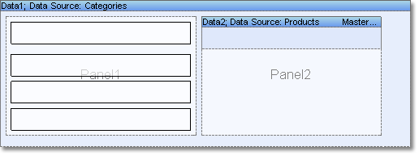

## Placing Panels on Band

The second way is when the panel in placed on a band. This variant is used both for grouping simple components on a panel and to output bands on a band. This allows rendering very complex reports. But it is important to know that the report template can be difficult in "reading".

