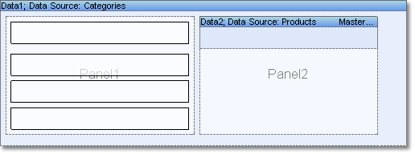

## Placing Panels on Band

The second option is when the panel is placed on a band. This approach can be used both to group simple components on a panel and to place bands on another band. This makes it possible to create very complex reports. However, you should use panels this way with caution, as the report template can become difficult to “read.”

