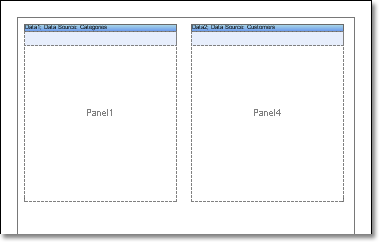

## Placing Panels on Page

It is the first way. Basically it is used as organization some independent streams of printing. Panels can be places on any part of a page. Each panel is a small page. So it is allowed placing some small pages with bands and components on one page. So it is possible to render a lot of complex reports.

* **Notice:** Number of panels on one page is unlimited.
