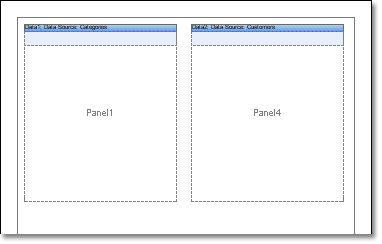

## Placing Panels on Page

This is the first approach. It is primarily used to organize independent print streams. Panels can be placed anywhere on a page, and each panel functions as a small page. This makes it possible to place several small pages, each containing bands and components, on a single page. As a result, you can render a wide range of complex reports.

* **Note:** The number of panels on one page is unlimited.
