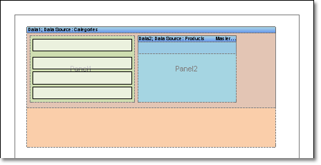

## Placing Panels on Panel

The third way – when a panel is placed on another panel. This variant is combination of two previous ones. It is very important to know that panels insertion should be used very carefully. Number of insertions in unlimited but such  report will not have good look.

