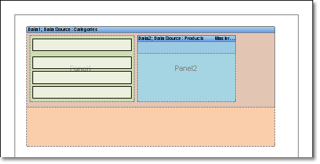

## Placing Panels on Panel

The third way – when a panel is placed on another panel. This variant is a combination of the two previous ones. It is very important to know that panel insertion should be used very carefully. The number of insertions is unlimited, but such a report will not have a good look.

