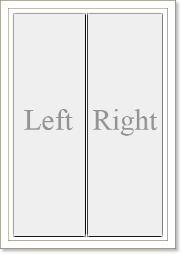
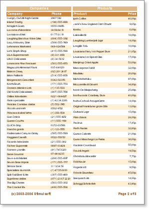

## Side-by-Side Reports

Side-by-side report is a report in what containers can help to speed up report creation. Two lists of rows are output simultaneously in this report. Both lists are independent from each other. Usually it is necessary to use the Sub report component to create such a report. But it is much easier to create a report with panels.

How to build a Side-by-Side report. Put two containers on a page. Set the DockStyle property of one component to Left. Set the DockStyle property of the second component to Right. Docking component is necessary to take all space on a page by the height. In cases it should not be done. Leave some space between lists to separate them. Put two bands on the first panel: the Header band and the Data band. The first list will output using these bands. Do the same in the second container. As a result two lists will be output on one page simultaneously.

