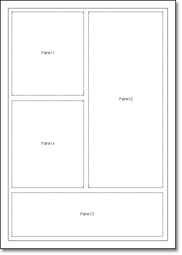

## Panels

Panel is a rectangular region that may contain other components including bands. If to move a panel then all components in it are moved too. The panel can be placed both on a band and on a page. This gives unique abilities in report creation.

