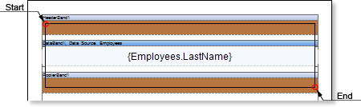
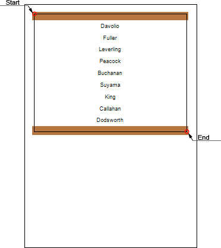

## Cross-Primitives

Cross-primitives include: **Vertical Line**, **Rectangle** and **Rounded Rectangle**. The start and end points of cross-primitives can be placed on different components of a report. When designing a report with cross-primitives the report generator renders start and end points of a vertical line, and then, between two points, it renders a vertical line. The picture below shows an example of a report template with a rectangle:

As can be seen in the picture, the start and end points of the **Rectangle** component are located on different bands: the start point is located in the **HeaderBand**, and the end point is in the **FooterBand**. When rendering the report, the report generator will render start and end points of the rectangle, and then it will render rectangle sides. The picture below shows an example of the rendered report pages with the **Rectangle** cross-primitive:

