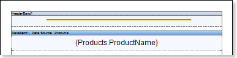
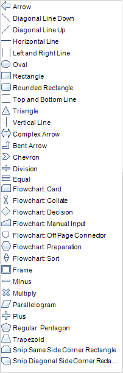

## Primitives

Primitives include: Horizontal Line and Shape. Cross-primitives include: Vertical Line, Rectangle and Rounded Rectangle. Horizontal line is a line in the horizontal plane, which start and end points are located on the same component in a report. The picture below shows a report template with a list in which a Horizontal Line is located in the HeaderBand:

The Shape is a report component, which, depending on the type, shows this or that primitive. The ShapeType property is used to specify a primitive type. The picture below shows a list of values of the ShapeType property:

