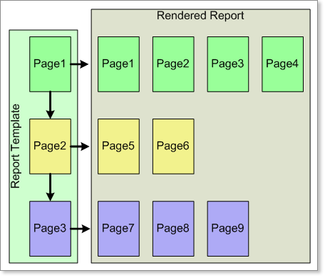

## Report Rendering

Unlike most other reporting tools, the report template in Stimulsoft Reports is divided into pages. Each page can have its own size and printing field. All components are placed on the report pages. During rendering, Stimulsoft Reports sequentially processes all the pages of the report."

The structure of the report provides greater flexibility in constructing the report. You can choose to exclude or include specific pages as needed. It is possible to change the order of page inclusion in the report. You can also establish relationships between pages. With the Sub-Report component, there is no need to rely on external reports, as the Sub-Report in Stimulsoft Reports is considered one of the report's own pages.
