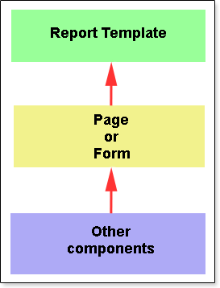

## Report Structure

When creating a report in the designer, a report template is generated either as a page or a form. No other elements can be directly placed on the template. All other elements of the report template are arranged on the page or form. The picture below illustrates the hierarchy of the report.

All elements of the template are divided into two categories: components and containers. The fundamental difference between a component and a container is that a container can be nested within another container or another component, while it is not possible to embed anything within a component. For instance, the Text is a component, and it can be positioned on a page or within another container. However, it is not possible to place any container or component inside the Text component. On the other hand, the Form can serve as a container, where components or containers can be placed.
